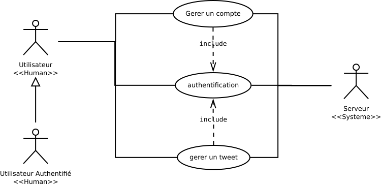

# Description des différents use cases identifiés
- 1: Gérer compte
- 2: Gérer tweet
- 3: Authentification

# Description des scénarios identifiés pour Gérer compte:
- [Créer un compte](./scenarios_gerer_compte/creer_compte.md)
- Supprimer un compte
- Modifier un compte -pour la V2-

# Description des scénarios identifiés pour Gérer tweet
- [Poster un tweet](./scenarios_gerer_tweet/poster_tweet.md)
- Modifier un tweet
- Supprimer un tweet
- Lire un tweet

# Description des scénarios identifiés pour Authentification
- Se logguer
- Se déconnecter
- *peut être gérer la déconnexion auto ici ?*

# Schema
- 
